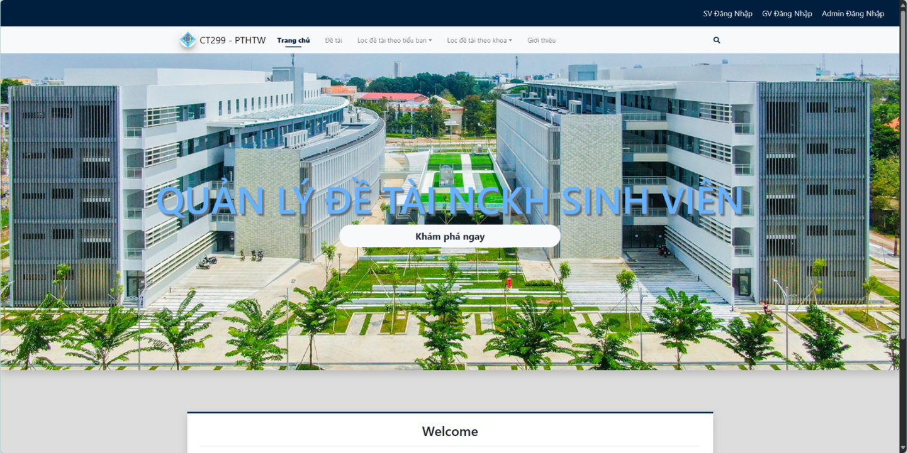
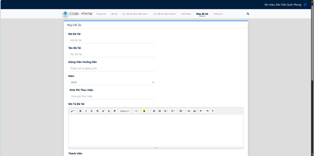
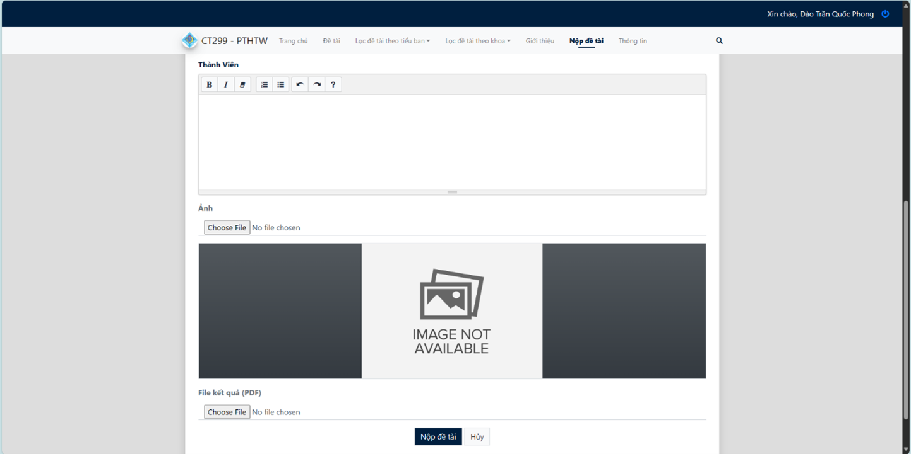
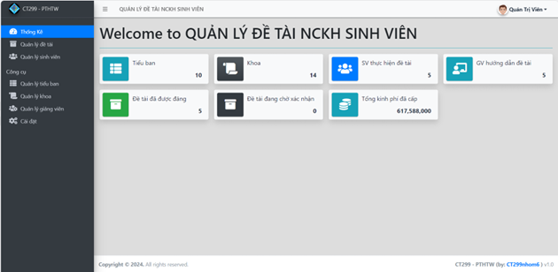
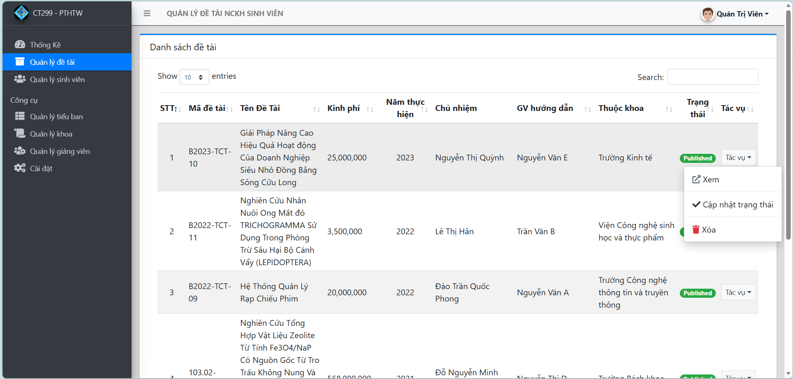
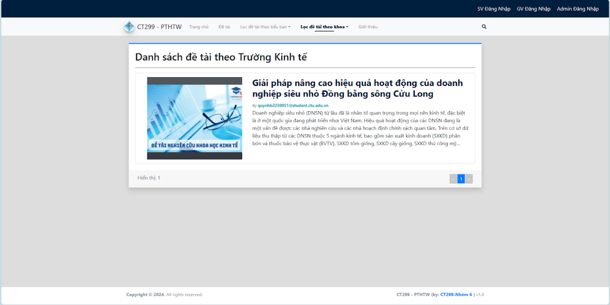

# Student Research Management System (SRMS)
> Hệ thống quản lý đề xuất và đăng ký đề tài Nghiên cứu khoa học dành cho sinh viên.

## 📝 Giới thiệu dự án
Dự án được xây dựng nhằm số hóa quy trình quản lý nghiên cứu khoa học tại trường đại học. Hệ thống giúp sinh viên có thể dễ dàng đề xuất ý tưởng và đăng ký các đề tài nghiên cứu của mình. Đồng thời, giảng viên cũng có thể theo dõi và đánh giá các đề xuất này, đồng hành và hỗ trợ sinh viên trong quá trình phát triển ý tưởng và thực hiện dự án nghiên cứu của mình.
Ngoài ra, hệ thống còn lưu trữ và tổ chức các tài liệu tham khảo từ những nghiên cứu trước đó, tạo điều kiện thuận lợi cho việc nghiên cứu và tiếp cận kiến thức. Điều này giúp tăng cường khả năng sáng tạo và đổi mới, đồng thời giảm thiểu thời gian và công sức mà sinh viên và giảng viên phải bỏ ra trong quá trình nghiên cứu.

**Các tính năng chính:**
* **Sinh viên:** Nộp đề tài NCKH, xem trạng thái và quản lý các đề tài cá nhân.
* **Giảng viên:** Theo dõi danh sách sinh viên tham gia, xem thống kê và tất cả đề tài trên hệ thống.
* **Quản trị viên:** Có quyền cao nhất, quản lý đề tài, sinh viên, giảng viên, khoa và các tiểu ban.

## 🛠 Tech Stack
Dự án được phát triển với các công nghệ chính:
* **Backend:** PHP (Framework Laravel).
* **Database:** MySQL.
* **Công cụ thiết kế:** PowerDesigner, StarUML.
* **Giao diện:** HTML, CSS (Bootstrap), JavaScript.

## 📸 Demo Hệ thống

### 1. Trang chủ Hệ thống
Giao diện tổng quan dành cho người dùng khi truy cập vào hệ thống.

### 2. Chức năng Nộp đề tài
Giao diện dành cho sinh viên thực hiện nộp các thông tin chi tiết về đề tài nghiên cứu.

### 3. Quản lý Đề tài và Thống kê
Giao diện dành cho Admin và Giảng viên để theo dõi số lượng đề tài và tổng kinh phí đã cấp.

### 4. Lọc đề tài theo Khoa/Tiểu ban
Hệ thống hỗ trợ lọc đề tài thông minh theo từng đơn vị quản lý chuyên trách.

